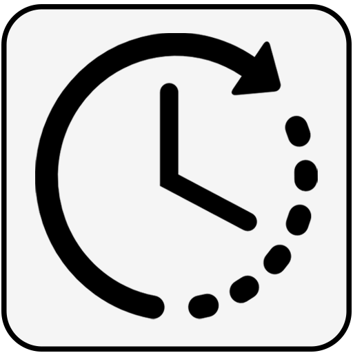

# TimeTracker

**TimeTracker** is a free, open-source desktop application for tracking your work, projects, and productivity. Built with React, Electron, and Tailwind CSS, it provides a seamless and privacy-friendly experience for freelancers, professionals, and anyone who wants to understand and improve their time usage.

---

## Features

- **Dashboard**:  
  Get a real-time overview of your daily, weekly, and monthly tracked hours, active tasks, and progress toward your daily goal.

- **Projects & Tasks**:  
  Organize your work into projects and tasks. Start/stop timers, mark projects as complete, and manage everything with an intuitive UI.

- **Automatic Screenshots**:  
  Optionally capture screenshots at random intervals while tracking time for accountability and review.

- **Reports**:  
  See a breakdown of time spent on each project and task. Drill down into details, view tracked sessions, and see all screenshots for any project.

- **History**:  
  Browse your activity grouped by date or project, with total time tracked and screenshots for each group. Pagination for easy navigation.

- **Analytics**:  
  Visualize your productivity with charts:  
  - Time by project (pie chart)  
  - Active vs idle time (bar chart)  
  - Time by day (line chart)  
  - Most active hour (bar chart)  
  - Top projects

- **Work Status & Focus**:  
  See your current status (working, idle, on break), quickly resume your last task, and track your daily goal progress. Take a break with a single click.

- **Task List**:  
  View and manage your tasks directly from the dashboard, with quick start/stop controls.

- **Settings**:  
  - Dark mode toggle  
  - Set daily time goal  
  - Idle timeout  
  - Enable/disable screenshot capture  
  - Notification and break reminder options  
  - Import/export or clear all data

- **Minimize to Tray**:  
  The app runs in the background and minimizes to the system tray for distraction-free tracking.

- **Help & Support**:  
  Built-in help page, FAQ, and links to GitHub for issues and contributions.

---

## Goals

- **Privacy-first**: All data is stored locally. No cloud, no tracking, no ads.
- **Simple & Fast**: Lightweight, responsive, and easy to use.
- **Customizable**: Flexible settings for screenshots, notifications, and more.
- **Open Source**: MIT licensed. Contributions welcome!
- **Cross-platform**: Works on Windows, macOS, and Linux.

---

## Screenshots



---

## Installation

### Prerequisites

- [Node.js](https://nodejs.org/) (v16 or later)
- [npm](https://www.npmjs.com/) or [yarn](https://yarnpkg.com/)
- [Electron](https://www.electronjs.org/)

### Steps

1. **Clone the repository:**
   ```bash
   git clone https://github.com/fullstack-joy/MyTimeTracker.git
   cd TimeTracker
   ```

2. **Install dependencies:**
   ```bash
   npm install
   ```

3. **Start the development server:**
   ```bash
   npm run start
   ```

4. **Build the application for production:**
   ```bash
   npm run build
   ```

5. **Package the application:**
   ```bash
   npm run build:mac  # For macOS
   npm run build:win  # For Windows
   ```

---

## macOS Icon Generation

To generate the required `icon.iconset` and `icon.icns` for macOS:

1. **Create the iconset folder:**
   ```bash
   mkdir -p assets/icon.iconset
   ```

2. **Generate all required PNG sizes from your base icon (e.g., `icon_512x512.png`):**
   ```bash
   sips -z 16 16     assets/icon_512x512.png --out assets/icon.iconset/icon_16x16.png
   sips -z 32 32     assets/icon_512x512.png --out assets/icon.iconset/icon_16x16@2x.png
   sips -z 32 32     assets/icon_512x512.png --out assets/icon.iconset/icon_32x32.png
   sips -z 64 64     assets/icon_512x512.png --out assets/icon.iconset/icon_32x32@2x.png
   sips -z 128 128   assets/icon_512x512.png --out assets/icon.iconset/icon_128x128.png
   sips -z 256 256   assets/icon_512x512.png --out assets/icon.iconset/icon_128x128@2x.png
   sips -z 256 256   assets/icon_512x512.png --out assets/icon.iconset/icon_256x256.png
   sips -z 512 512   assets/icon_512x512.png --out assets/icon.iconset/icon_256x256@2x.png
   sips -z 512 512   assets/icon_512x512.png --out assets/icon.iconset/icon_512x512.png
   cp assets/icon_512x512.png assets/icon.iconset/icon_512x512@2x.png
   ```

3. **Convert the iconset to `.icns`:**
   ```bash
   iconutil --convert icns --output assets/icon.icns assets/icon.iconset
   ```

---

## Making a Release

To create a production-ready release of TimeTracker:

1. **Build the frontend:**
   ```bash
   npm run build
   ```

2. **Package the Electron app:**
   - For macOS:
     ```bash
     npm run build:mac
     ```
   - For Windows:
     ```bash
     npm run build:win
     ```
   - For a cross-platform build (if configured):
     ```bash
     npm run dist
     ```

3. **Find your packaged app:**
   - The output will be in the `dist/` or `release/` folder (depending on your Electron Builder config).
   - You will see `.dmg` (macOS), `.exe` (Windows), or `.AppImage`/`.deb` (Linux) files ready to distribute.

4. **Test your release:**
   - Run the packaged app on your target OS to ensure everything works as expected.

5. **Publish your release:**
   - Upload the installer files to GitHub Releases or your preferred distribution platform.
   - Tag your release in git:
     ```bash
     git tag v1.0.0
     git push --tags
     ```

---

## Usage

- Launch the app and start tracking your time.
- Use the sidebar to navigate between Dashboard, Analytics, Projects, Reports, History, and Settings.
- Start a timer on any task to begin tracking.
- View detailed reports, analytics, and screenshots for accountability.
- Export or import your data at any time.

---

## Technologies Used

- **Frontend**: React, Tailwind CSS, Recharts
- **Backend**: Electron
- **Build Tools**: Vite, Electron Builder
- **State Management**: React Context API

---

## File Structure

```
src/
├── components/
│   ├── dashboard/
│   ├── layout/
│   ├── ui/
├── context/
├── pages/
├── styles/
├── App.jsx
├── index.jsx
```

---

## Contributing

Contributions are welcome!  
Please fork the repository, create a feature branch, and submit a pull request.

---

## License

This project is licensed under the [MIT License](LICENSE).

---

## Contact & Support

- [GitHub Issues](https://github.com/fullstack-joy/MyTimeTracker/issues)
- For questions or feedback, open an issue or pull request.

---

## Roadmap

- [ ] Mobile companion app (iOS/Android)
- [ ] Team collaboration features
- [ ] Integrations with Slack, Trello, Asana, etc.
- [ ] AI-powered productivity insights
- [ ] Offline mode with sync

---

**TimeTracker** — Track your time, own your data, and boost your productivity!
